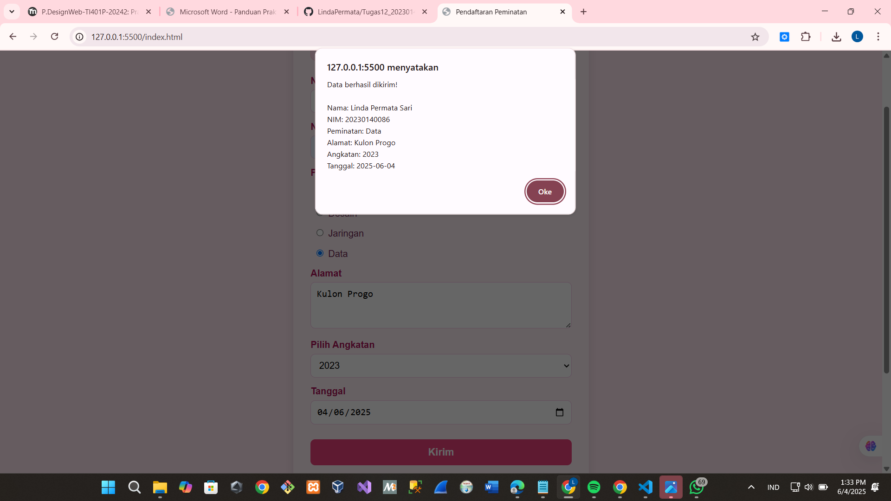

# Tugas12_20230140086

## 🌸 Form Peminatan Mahasiswa

Tugas ini adalah implementasi form pendaftaran peminatan menggunakan HTML dan CSS inline, dengan fitur:

- Input: Nama, NIM, Alamat
- Pilihan peminatan (Programming, Desain, Jaringan, Data)
- Pilih angkatan
- Pilih tanggal input
- Alert konfirmasi + tampilkan hasil input di bawah form

## 📸 Screenshot Hasil

---

✅ Tugas ini dikumpulkan melalui **MyKlass**
